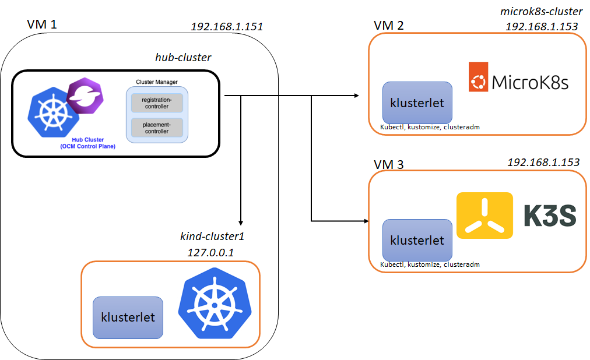

# OCM

## OCM architecture

## TESTBED architecture

See [local environment setup](test-environment-setup.md) for more information about how to create and configure the following testbed architecture.

